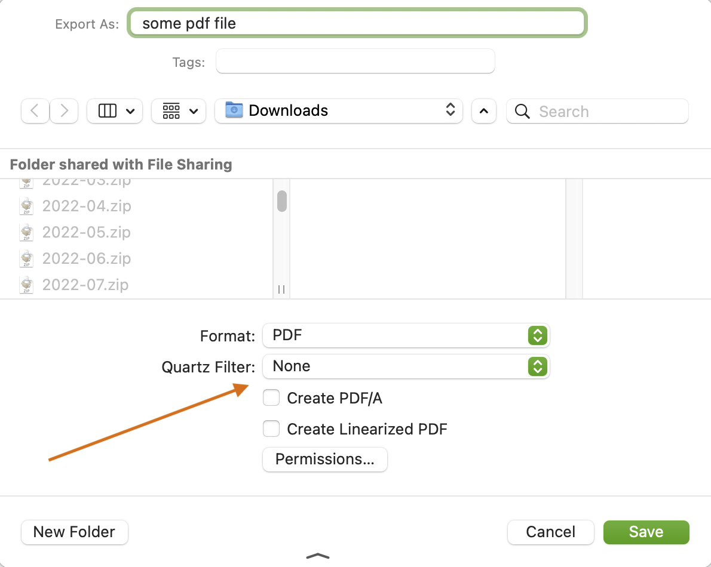
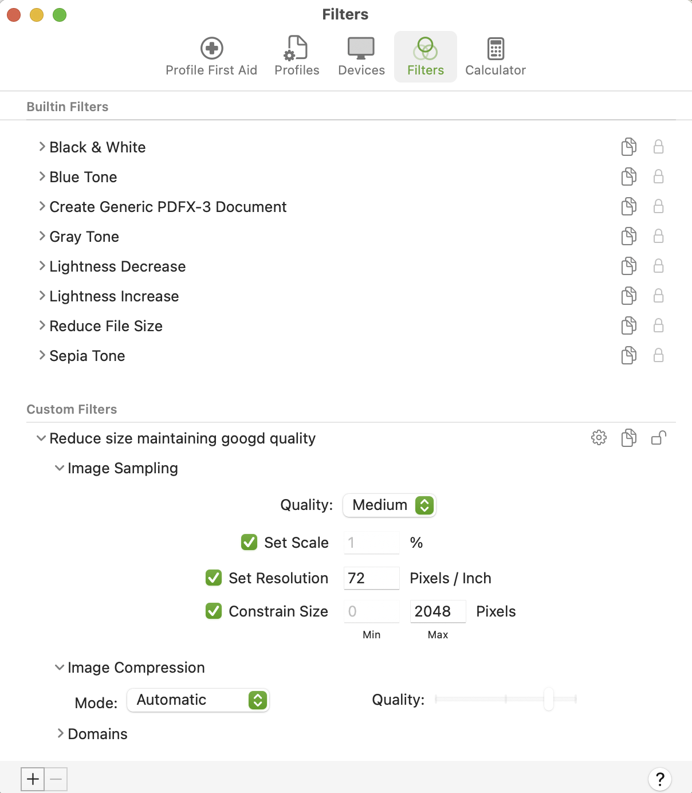

# MacOS Quartz filters

_Quartz Filters_, which originated in [Quartz Composer](https://en.wikipedia.org/wiki/Quartz_Composer), are filters that can be applied to images in macOS to manipulate them in various ways. They can be accessed in certain places in macOS, such as in the export dialog in Preview.

The default filters installed by macOS include "Black & White.qfilter", "Lightness Decrease.qfilter", and others. You also can create and install your own filters. You can find examples of how to do that can be found on various web pages. The file format of Quartz Filters is [XML](https://en.wikipedia.org/wiki/XML) files, and a new one can be created easily like this:

1. Create the directory `~/Library/Filters` if it doesn't exist.
2. Copy an example file such as `/System/Library/Filters/Reduce File Size.qfilter` to a new file in your `~/Library/Filters` directory.
3. Edit the file to adjust the parameters as desired.

This directory contains a filter I created in an effort to reduce the size of PDF files. The effectiveness of this filter is mixed: it shrinks some PDF files, but enlarges others, and it's not obvious at the outset which way a given PDF file will go. It's the kind of thing that you have to try it with and without, and decide which version of the PDF file you want to use.

Tip for creating Quartz filters: open both _ColorSync Utility_ and _Preview_ at the same time, with a PDF file in _Preview_ that you want to test. The changes you make to a filter in _ColorSync Utility_ are available immediately in export filters in _Preview_, so you can iterate pretty quality. Create a new profile in _ColorSync Utility_ (in the _Filters_ tab) and then:

1. Adjust the filter values in _ColorSync Utility_
2. Switch to _Preview_ and export the PDF file
3. Check the file size and quality
4. Switch back to _ColorSync Utility_

References:
* <https://apple.stackexchange.com/questions/297417/how-to-decrease-pdf-size-without-losing-quality>
